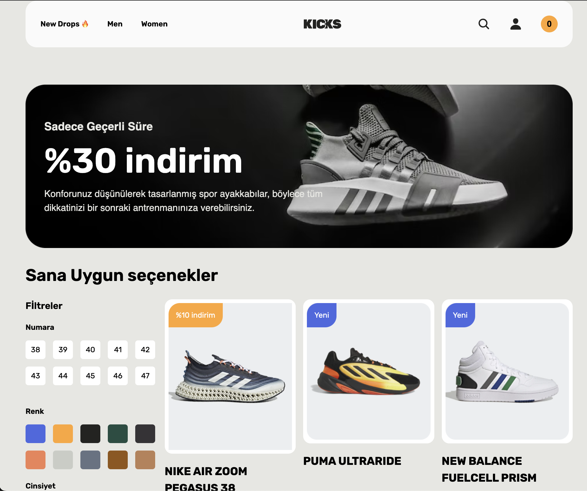
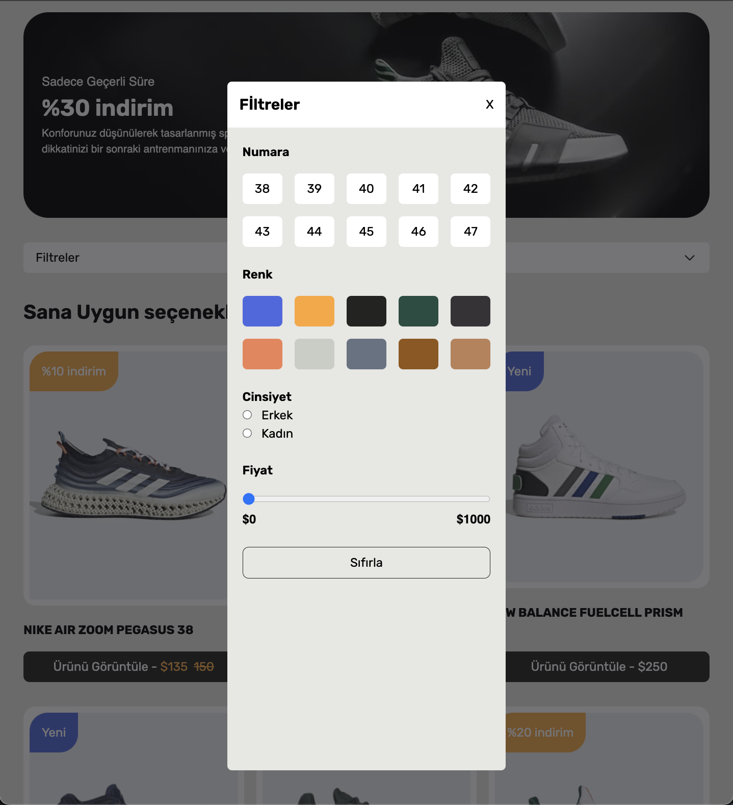
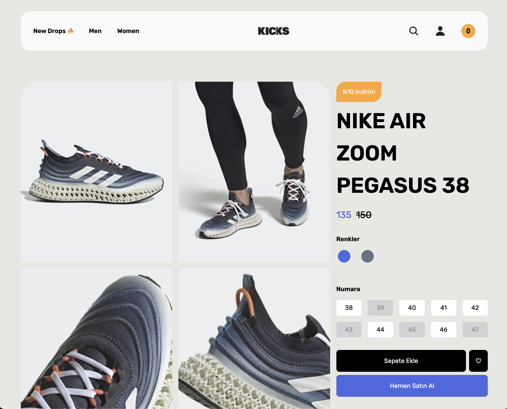

# Shoes Store Web Application

## Project Overview

This project is a responsive, user-friendly web application for managing and displaying shoe data using TanStack Query and JSON Server. The main goal is to create a fully responsive and user-friendly web application that aligns with a Figma design, while leveraging TanStack Query for efficient API data management. The app includes filtering options on the Home page and stock control for available sizes on the Detail page.

## Screenshots

## Video gif


### Home Page



### Home Modal



### Detail Page



## Features

- Home Page: Users can filter products by size, color, and price.

- Detail Page: Users can check stock availability for specific sizes; only sizes in stock are displayed.
- Responsive Design: The application is optimized for all screen sizes.
- Security: XSS attacks are prevented using the xss library.

## Technologies Used

- React: Frontend framework for building UI components
- TanStack Query (@tanstack/react-query): Manages API data, caching, and synchronization
- Axios: Handles HTTP requests
- JSON Server: Provides a mock REST API for development
- React Router Dom: Enables navigation between pages
- React Toastify: Displays user-friendly notifications
- XSS: Protects against potential cross-site scripting attacks
- @uidotdev/usehooks: Provides custom hooks for enhanced functionality

## Getting Started

Follow these steps to run the project locally.

## Prerequisites

Ensure that Node.js and npm are installed.

## Setup Instructions,

### Installation

To run this project on your local machine, follow these steps:

1. Clone the repository:

   ```
   git clone https://github.com/ozerbaykal/shoes_tanstack_query.gity.git
   ```

2. Install dependencies:

   ```
   npm install
   ```

3. Starting JSON Server
   Start JSON Server to simulate the database:

```
npm run server
```

4. Start the application:
   ```
   npm run dev
   ```
   This will start the frontend development server, and you can access the application at http://localhost:5173

## Functionality

- Filtering: Users can filter products by size, color, and price on the Home page.
- Stock Management: Only available sizes are displayed on the Detail page.

## Usage

### Home Page
Users can filter products by size, color, and price to quickly find what they’re looking for.

### Detail Page

Displays only the sizes available in stock for the selected product.

<h2>Contributing</h2>

Contributions are welcome! Please open an issue first to discuss what you would like to change.

- 1.Fork the project
- 2.Create your feature branch (git checkout -b feature/NewFeature)
- 3.Commit your changes (git commit -m 'Add new feature')
- 4.Push to the branch (git push origin feature/NewFeature)
- 5.Open a Pull Request

<h2>Contact</h2>

Özer BAYKAL mail : baykalozer87@gmail.com

Project Link: https://github.com/ozerbaykal/shoes_tanstack_query
